# SMBOX: Sequential Model-Based Optimization eXpress Algorithm

## Table of Contents
- [Process Diagram](#process-diagram)
- [Key Components and Features](#key-components-and-features)
- [Algorithm Details](#algorithm-details)
  - [Meta-Parameters](#meta-parameters)
  - [Benefits of SMBOX](#benefits-of-smbox)
- [Implementation Notes](#implementation-notes)

## Process Diagram

```mermaid
%%{init: {'theme': 'base', 'themeVariables': { 'fontSize': '14px', 'fontFamily': 'arial' }}}%%
flowchart TD
    classDef default fill:#f9f9f9,stroke:#333,stroke-width:2px;
    classDef mainNode fill:#e1f5fe,stroke:#01579b,stroke-width:2px,font-size:14px;
    classDef resultNode fill:#e8f5e9,stroke:#2e7d32,stroke-width:2px,font-size:14px;
    classDef phaseBox fill:#f5f5f5,stroke:#666,stroke-width:1px,stroke-dasharray: 5 5;
    classDef header fill:white,stroke:none,color:black,font-size:20px,font-weight:bold;
    
    subgraph SMBOX[" "]
        DiagramTitle["SMBOX HPO Algorithm Flow"]:::header
        
        %% Setup Phase
        subgraph Setup["Initialization & Setup"]
            Input["Input Configuration<br><br>• Algorithm type<br>• Parameter space<br>• Objective function<br>• Time budget"]
            Init["Initialization Phase<br><br>1. Create low-fidelity dataset<br>2. Generate initial random population<br>3. Evaluate initial configurations"]
            History["Create History Table<br><br>• Store evaluations<br>• Track global best<br>• Initialize gen = 0"]
            UpdateSchema["Update Config Schema<br><br>• Adapt param bounds<br>• Update distributions<br>• Focus on promising regions"]
        end
        
        %% Optimization Loop
        subgraph Loop["Main Optimization Loop"]
            MainLoop["Main Loop"]
            
            subgraph ModelFit["Model Training & Prediction"]
                Response["Fit Response Surface<br><br>• Train CatBoost model<br>• Learn from history<br>• Predict new configs"]
                Predict["Predict Performance<br><br>• Score candidates<br>• Rank by predicted performance"]
            end
            
            subgraph GenSelect["Generation & Selection"]
                Generate["Generate Candidates<br><br>• Create large pool<br>• Apply feasibility checks"]
                Select["Selection Strategy<br><br>• Select top configs<br>• Add exploration configs<br>• Add pseudo-random configs"]
            end
            
            subgraph Evaluation["Evaluation & Tracking"]
                Evaluate["Evaluate Population<br><br>• Run objective func<br>• Score configurations<br>• Track performance"]
                UpdateHist["Update History<br><br>• Add new evaluations<br>• Update global best<br>• Track improvements"]
            end
            
            subgraph TerminationChecks["Termination Checks"]
                TimeCheck["Time Budget Check<br><br>• Continue iteration if time remains<br>• Exit if time up"]
                TermCheck["Termination Check<br><br>Is time_status == 'OK'"]
            end
        end
        
        %% Final Result
        Result["Return Best Result<br><br>• Best parameters<br>• Best performance<br>• Save trials data"]
        
        %% Connect Setup Phase
        Input --> Init
        Init --> History
        History --> UpdateSchema
        UpdateSchema --> MainLoop
        
        %% Connect Main Loop components
        MainLoop --> ModelFit
        MainLoop --> GenSelect
        Response <--> Generate
        Response --> Predict
        Generate --> Select
        Predict --> Select
        Select --> Evaluate
        Evaluate --> UpdateHist
        UpdateHist --> TimeCheck
        TimeCheck --> TermCheck
        TermCheck -->|No| MainLoop
        TermCheck -->|Yes| Result
    end
    
    %% Apply classes to nodes
    class MainLoop mainNode;
    class Result resultNode;
    class Setup,Loop,ModelFit,GenSelect,Evaluation,TerminationChecks phaseBox;
    
    %% Style definitions
    style SMBOX fill:#ffffff,stroke:#333,stroke-width:4px,color:#333,padding:60px;
```

## Key Components and Features

SMBOX consists of several key components that work together to efficiently optimize hyperparameters:

1. **Initialization Phase**
   - Creates a low-fidelity dataset for faster initial evaluation (if configured)
   - Generates an initial population of random hyperparameter configurations
   - Evaluates these initial configurations to build a foundation for learning

2. **Response Surface Model**
   - Uses CatBoost as a surrogate model to learn the relationship between hyperparameters and performance
   - Trained on history of previously evaluated configurations
   - Provides fast approximations of expensive objective function evaluations

3. **Adaptive Parameter Space**
   - Updates the parameter search space based on promising regions
   - Focuses exploration on areas with high-performing configurations
   - Dynamically narrows or expands search boundaries based on observed results

4. **Candidate Generation & Selection**
   - Generates a large pool of potential hyperparameter configurations
   - Predicts their performance using the surrogate model
   - Selects the most promising candidates while maintaining exploration

5. **Exploration Strategies**
   - Injects random configurations to prevent premature convergence
   - Optional pseudo-random configurations for targeted exploration
   - Balances exploitation (using best known areas) and exploration (trying new areas)

6. **Time-Based Termination**
   - Runs until a predefined time budget is exhausted
   - Returns the best configuration found within the time constraints
   - Ensures practical usability in time-constrained environments

7. **Performance Tracking**
   - Logs all evaluations and tracks global best
   - Monitors improvements throughout the optimization process
   - Integrates with MLflow for experiment tracking (when enabled)

## Algorithm Details

The SMBOX (Sequential Model-Based Optimization eXpress) algorithm efficiently navigates the hyperparameter space by learning from previous evaluations, focusing on promising regions, and maintaining a balance between exploration and exploitation. This approach is particularly effective for expensive black-box optimization problems like hyperparameter tuning.

### How It Works

1. **Initial Sampling**: The algorithm begins by evaluating a set of random configurations to build an initial understanding of the parameter space.

2. **Surrogate Modeling**: A CatBoost model is trained on the history of evaluated configurations to predict the performance of new, untested configurations.

3. **Acquisition Function**: The algorithm uses the surrogate model to identify promising configurations that balance the exploration of uncertain regions with the exploitation of known high-performing regions.

4. **Iterative Improvement**: Through successive iterations, the algorithm refines its understanding of the parameter space and converges toward optimal configurations.

### Meta-Parameters

The algorithm is controlled by several meta-parameters that determine its behavior:

| Parameter | Description | Typical Values |
|-----------|-------------|----------------|
| `lf_init_ratio` | Ratio for low-fidelity dataset creation during initialization | 0.1 - 0.3 |
| `lf_init_n` | Number of initial random configurations to evaluate | 10 - 30 |
| `lf_ratio` | Ratio for low-fidelity dataset during main optimization | 0.1 - 0.5 |
| `alpha_n` | Number of top candidates to select in each iteration | 5 - 20 |
| `inc_rand` | Whether to include random configurations | Y/N |
| `inc_pseudo_rand` | Whether to include pseudo-random configurations | Y/N |

### Benefits of SMBOX

1. **Efficiency**: Optimizes expensive hyperparameter configurations with fewer evaluations
2. **Adaptability**: Adjusts search space based on promising areas
3. **Balance**: Maintains effective exploration-exploitation trade-off
4. **Time-awareness**: Works within specified time constraints
5. **Flexibility**: Can be used with any machine learning algorithm
6. **Scalability**: Works with both simple and complex parameter spaces

## Implementation Notes

SMBOX is designed to be easy to use while providing powerful optimization capabilities. Here are some implementation considerations:

- **Default Parameter Spaces**: SMBOX includes pre-defined parameter spaces for common ML algorithms (Random Forest, XGBoost, etc.)
- **Custom Objectives**: Users can define their own objective functions to optimize any metric
- **Integration with MLflow**: Results can be tracked and visualized using MLflow
- **Time Management**: The algorithm respects time budgets and gracefully terminates when time is up

For code examples and usage patterns, please refer to the [README.md](README.md) file. 