# SMBOX: Sequential Model-Based Optimization eXpress Algorithm

## Process Diagram

```mermaid
flowchart TB
    subgraph SMBOX ["SMBOX HPO Algorithm Flow"]
        Input["Input Configuration<br>- Algorithm type<br>- Parameter space<br>- Objective function<br>- Time budget"]
        Init["Initialization Phase<br>1. Create low-fidelity dataset<br>2. Generate initial random population<br>3. Evaluate initial configurations"]
        History["Create History Table<br>- Store evaluations<br>- Track global best<br>- Initialize gen = 0"]
        UpdateSchema["Update Config Schema<br>- Adapt param bounds<br>- Update distributions<br>- Focus on promising regions"]
        MainLoop["Main Loop"]
        Response["Fit Response Surface<br>- Train CatBoost model<br>- Learn from history<br>- Predict new configs"]
        Generate["Generate Candidates<br>- Create large pool<br>- Apply feasibility checks"]
        Predict["Predict Performance<br>- Score candidates<br>- Rank by predicted performance"]
        Select["Selection Strategy<br>- Select top configs<br>- Add exploration configs<br>- Add pseudo-random configs"]
        Evaluate["Evaluate Population<br>- Run objective func<br>- Score configurations<br>- Track performance"]
        UpdateHist["Update History<br>- Add new evaluations<br>- Update global best<br>- Track improvements"]
        TimeCheck["Time Budget Check<br>- Continue iteration if time remains<br>- Exit if time up"]
        TermCheck["Termination Check<br>Is time_status == 'OK'"]
        Result["Return Best Result<br>- Best parameters<br>- Best performance<br>- Save trials data"]

        Input --> Init
        Init --> History
        History --> UpdateSchema
        UpdateSchema --> MainLoop
        MainLoop --> Response
        MainLoop --> Generate
        Response <--> Generate
        Response --> Predict
        Generate --> Select
        Predict --> Select
        Select --> Evaluate
        Evaluate --> UpdateHist
        UpdateHist --> TimeCheck
        TimeCheck --> TermCheck
        TermCheck -->|No| MainLoop
        TermCheck -->|Yes| Result
    end

    style SMBOX fill:#f5f5f5,stroke:#333,stroke-width:2px
    style MainLoop fill:#e1f5fe,stroke:#01579b,stroke-width:2px
    style Result fill:#e8f5e9,stroke:#2e7d32,stroke-width:2px
```

## Key Components and Features

1. **Initialization Phase**:
   - Creates a low-fidelity dataset for faster initial evaluation (if configured)
   - Generates an initial population of random hyperparameter configurations
   - Evaluates these initial configurations to build a foundation for learning

2. **Response Surface Model**:
   - Uses CatBoost as a surrogate model to learn the relationship between hyperparameters and performance
   - Trained on history of previously evaluated configurations

3. **Adaptive Parameter Space**:
   - Updates the parameter search space based on promising regions
   - Focuses exploration on areas with high-performing configurations

4. **Candidate Generation & Selection**:
   - Generates a large pool of potential hyperparameter configurations
   - Predicts their performance using the surrogate model
   - Selects the most promising candidates while maintaining exploration

5. **Exploration Strategies**:
   - Injects random configurations to prevent premature convergence
   - Optional pseudo-random configurations for targeted exploration
   - Balance between exploitation (using best known areas) and exploration (trying new areas)

6. **Time-Based Termination**:
   - Runs until a predefined time budget is exhausted
   - Returns the best configuration found within the time constraints

7. **Performance Tracking**:
   - Logs all evaluations and tracks global best
   - Monitors improvements throughout the optimization process
   - Integrates with MLflow for experiment tracking (when enabled)

## Algorithm Details

The SMBOX (Sequential Model-Based Optimization eXpress) algorithm efficiently navigates the hyperparameter space by learning from previous evaluations, focusing on promising regions, and maintaining a balance between exploration and exploitation. This approach is particularly effective for expensive black-box optimization problems like hyperparameter tuning.

### Meta-Parameters

The algorithm is controlled by several meta-parameters that determine its behavior:

- `lf_init_ratio`: Ratio for low-fidelity dataset creation during initialization
- `lf_init_n`: Number of initial random configurations to evaluate
- `lf_ratio`: Ratio for low-fidelity dataset during main optimization
- `alpha_n`: Number of top candidates to select in each iteration
- `inc_rand`: Whether to include random configurations (Y/N)
- `inc_pseudo_rand`: Whether to include pseudo-random configurations (Y/N)

### Benefits of SMBOX

1. **Efficiency**: Optimizes expensive hyperparameter configurations with fewer evaluations
2. **Adaptability**: Adjusts search space based on promising areas
3. **Balance**: Maintains effective exploration-exploitation trade-off
4. **Time-awareness**: Works within specified time constraints
5. **Flexibility**: Can be used with any machine learning algorithm
6. **Scalability**: Works with both simple and complex parameter spaces 